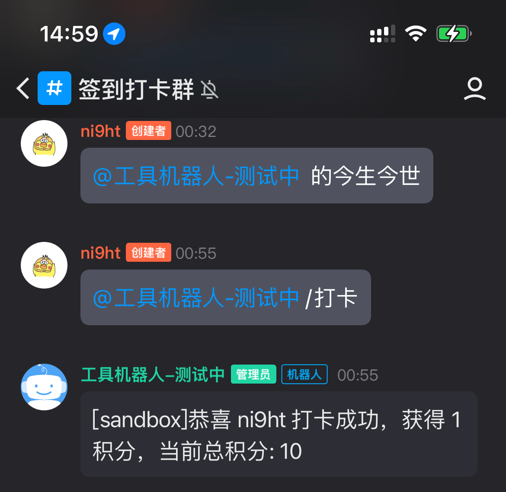

# qqbot
该项目根据 QQ 机器人官方提供的 API 来实现，并且提供了一些简单的功能。 

[设计文档](./docs/design.md)

## 依赖环境
- Go 1.17
- Redis

## 快速使用
### 打卡功能
在频道内 AT 对应机器人，并使用 `/打卡` 指令来进行打卡操作。
打卡成功后，机器人会回复打卡成功，并返回获得的积分和当前总积分。
*注意：每天只能打卡一次，重复打卡不会获得积分。*


## 开发环境搭建
1. 拉取项目代码 `git clone https://github.com/Yni9ht/qqbot.git` 
2. 安装依赖 `go mod tidy`
3. 在项目根目录的 `config.yaml` 中填写配置信息
```yaml
botconfig:
  appid: #{申请的机器人 AppID}
  token: #{申请的机器人 Token}
redis:
  host: #{Redis 连接地址}
  port: 6379
  password:
  db: 0
```
4. 启动机器人 `go run qqbot.go`

## 项目部署
### Docker 部署
使用项目编写好的 Dockerfile 来部署项目。
`docker build --tag yni9ht/qqbot-server:beta .`