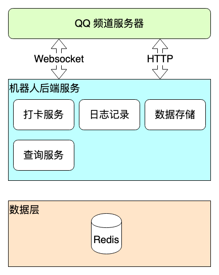
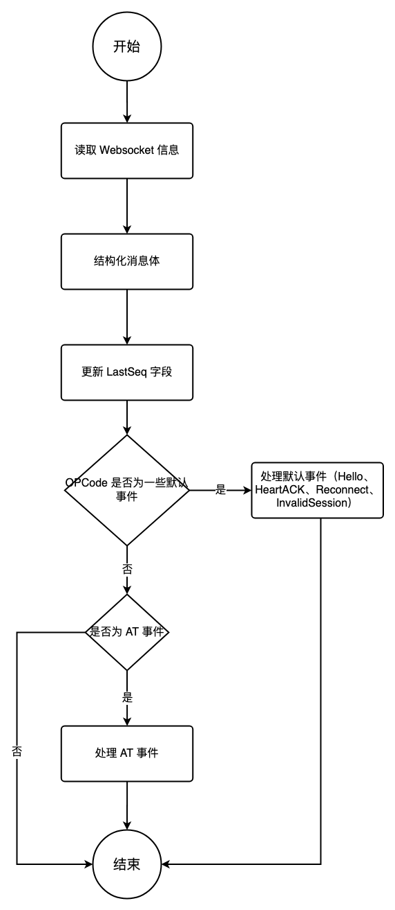

# qqbot 设计文档

本文档主要针对 qqbot 的设计进行了描述，包括一些功能点的设计细节。

[官方简介](https://bot.q.qq.com/wiki/#%E7%AE%80%E4%BB%8B) ｜ [官方 API 文档](https://bot.q.qq.com/wiki/develop/api/)

## 介绍


---

## 基本设计
**系统流程图**

**项目结构**
```
├── qqbot
│   ├── api // openAPI 接口
│   ├── docs // 文档
|   ├── log // 日志
│   ├── model // 数据模型
│   ├── redis // redis 数据库
│   ├── startup // 启动文件
│   ├── vars // 全局变量
│   ├── ws // WebSocket
│   ├── config.yaml // 配置文件
│   ├── main.go // 主程序
│   ├── README.md
```

### 配置管理
配置文件在项目 config 文件夹中，并采用 `yaml` 格式的配置文件。

### 请求方式
- HTTP：官方 http 库
- Websocket：[gorilla/websocket](https://github.com/gorilla/websocket)

### 日志管理
通过项目中简单封装的 `log` 将日志内容直接输出在控制台。
```go
// import "github.com/Yni9ht/qqbot/log"
log.Infof("ws gateway url: %s", url)
```

### 数据存储
采用 Redis 进行数据存储，主要用于存储用户的签到信息和积分信息。

### Client 管理
通过封装 Websocket 连接、 HTTP Client 和 Redis Client 来处理消息。
####Websocket 连接
```go
type Client struct {
	URL         string // wss 连接地址
	Token       string // 认证 Token
	Intent      model.Intent // 消息类型
	WssCon      *websocket.Conn // websocket 连接
	MessageChan chan *model.WSPayload // 消息队列
	CloseChan   chan error // 关闭通道
	LastSeq     uint32 // 最后接收到的消息序号
	Heart       *time.Ticker // 心跳定时器
}
```
包含：
- 发送消息
- 读取处理消息
- 关闭连接
#### HTTP Client
```go
type OpenAPI struct {
	URL     string // 请求地址
	Token   string  // 认证 Token
	Sandbox bool    // 是否为沙箱环境
	Client  *http.Client // HTTP Client
}
```
包含：
- 发送请求
- 处理响应
#### Redis Client
```go
type redisSvc struct {
	con *redis.Client // redis 连接
}
```
包含：
- 获取 Redis 连接
- 检查用户是否已经签到
- 更新用户签到信息
- 更新用户积分信息

---

## 功能点
### 签到
用户每天通过在打卡频道内 AT 机器人并输入 `/打卡` 命令来进行签到，每次签到获得 1 积分。每天仅可签到一次，重复签到不会获得积分。
